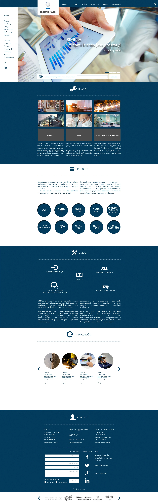

# Layout-Simple-Vue

> 🚀 **Modern Business Website Layout** - Build responsive corporate websites with Vue.js component architecture and modular design

## 📋 Description

Welcome to the **Layout-Simple** repository! This Vue.js-based business website demonstrates a professional, component-driven architecture with clean separation of data and presentation. The project features a fully responsive layout, modular components, carousel sliders, newsletter subscription, and dynamic content rendering.

Built with Vue.js 3 and organized with separate data files for easy content management, this project showcases best practices in modern frontend development. Perfect for learning component-based architecture, responsive design patterns, and maintainable code structure for corporate websites.

## 📁 Repository Structure

```

Layout-Simple-Vue/
├── 📁 frontend/
│ ├── 📁 public/
│ │ └── 📄 index.html # Main HTML entry point
│ ├── 📁 src/
│ │ ├── 🖼️ assets/ # Logo and media resources
│ │ ├── ⚛️ components/ # Vue components
│ │ │ ├── 📰 Aktualnosci.vue # News section
│ │ │ ├── 🏭 Branze.vue # Industries section
│ │ │ ├── 📧 Footer.vue # Footer with contact form
│ │ │ ├── 🏢 LogaFirm.vue # Partner company logos
│ │ │ ├── 🧭 Navbar.vue # Main navigation
│ │ │ ├── 📦 Produkty.vue # Products display
│ │ │ ├── 📋 Sidebar.vue # Sidebar menu
│ │ │ ├── 🎬 Slider.vue # Image carousel
│ │ │ └── 🛠️ Uslugi.vue # Services section
│ │ ├── 📊 data/ # Separated data files
│ │ │ ├── AktualnosciData.js # News content data
│ │ │ ├── BranzeData.js # Industries data
│ │ │ ├── FooterData.js # Footer information
│ │ │ ├── ProduktyData.js # Products data
│ │ │ ├── SliderData.js # Carousel images
│ │ │ └── UslugiData.js # Services data
│ │ ├── 🎨 styles/ # Component CSS files
│ │ │ ├── NavbarStyle.css
│ │ │ ├── SidebarStyle.css
│ │ │ ├── SliderStyle.css
│ │ │ ├── BranzeStyle.css
│ │ │ ├── ProduktyStyle.css
│ │ │ ├── UslugiStyle.css
│ │ │ └── FooterStyle.css
│ │ ├── 📄 views/ # Page views
│ │ │ └── HomeView.vue
│ │ ├── 💻 App.vue # Main application component
│ │ └── 🚀 main.js # Vue entry point
│ ├── 📦 package.json # Node.js dependencies
│ ├── 🔒 package-lock.json # Dependency lock file
│ ├── 🔧 start.bat # Windows startup script
│ ├── 🔧 start.sh # Linux/macOS startup script
│ └── 📖 README.md # Frontend documentation
├── 📁 grafika/ # Screenshots and design files
│ ├── 🖼️ simple.webp # Desktop preview
│ ├── 📱 simple 768.webp # Tablet preview
│ ├── 📱 simple 320.webp # Mobile preview
│ └── 🎨 *.psd # Photoshop design files
├── 📝 CHANGELOG # Version history
├── 📄 LICENSE # Project license
└── 📖 README.md # Main documentation

```

## 🚀 Getting Started

### 1. Clone the Repository

```bash
git clone https://github.com/dawidolko/Layout-Simple-Vue.git
cd Layout-Simple-Vue
```

### 2. Install Dependencies

```bash
cd frontend
npm install
```

### 3. Start Development Server

#### Windows:

```bash
start.bat
```

#### Linux/macOS:

```bash
bash start.sh
```

#### Manual Start:

```bash
npm run dev
```

- Access the application at [http://localhost:8000](http://localhost:8000)

## ⚙️ System Requirements

### **Essential Tools:**

- **Node.js** (version 14.0 or higher)
- **npm** or **yarn** package manager
- **Modern Web Browser** (Chrome, Firefox, Safari, Edge)
- **Git** for version control

### **Development Environment:**

- **Vue.js 3** with Composition API
- **Code Editor** (VS Code, WebStorm, Sublime Text)
- **Vue DevTools** browser extension (recommended)

### **Recommended Extensions:**

- **Volar** for Vue 3 support in VS Code
- **ESLint** for JavaScript code quality
- **Prettier** for code formatting
- **Live Server** for development
- **Vue VSCode Snippets** for faster development

### **Vue.js Ecosystem:**

- **Vue 3** - Progressive JavaScript framework
- **Vue Router** (if routing is needed)
- **ES6+** modern JavaScript features
- **CSS3** for styling

## ✨ Key Features

### **🧭 Navigation System**

- **Navbar Component**: Main navigation with sections (Industries, Products, Services, News, Contact, References)
- **Sidebar Component**: Extended menu with social media links (Facebook, LinkedIn)
- Responsive mobile-friendly navigation
- Smooth scrolling to sections

### **🎬 Interactive Slider**

- Image carousel with automatic rotation
- Newsletter subscription form integration
- Touch-friendly swipe support
- Responsive image loading

### **🏭 Industries Section (Branze)**

- 9 industry categories with interactive hover effects
- Gray background transition on hover
- Grid-based responsive layout
- Icon and text combinations

### **📦 Products Display (Produkty)**

- 10 circular product elements
- Modern card-based design
- Hover animations and effects
- Responsive grid system

### **🛠️ Services Section (Uslugi)**

- Service icons with descriptions
- Clean, professional presentation
- Icon-text combinations
- Flexible content management

### **📰 News Section (Aktualnosci)**

- News article slider/carousel
- Dynamic content loading from data files
- Image and text preview cards
- Read more functionality

### **📧 Footer with Contact**

- Contact form with validation
- Company contact details
- Social media integration
- Partner company logos slider

### **📊 Data-Driven Architecture**

- Separate data files in `data/` directory
- Easy content updates without touching components
- Centralized content management
- JSON-like data structure

### **🎨 Modular Styling**

- Component-specific CSS files
- Maintainable and scalable styles
- No style conflicts between components
- Easy customization and theming

### **📱 Responsive Design**

- Mobile-first approach (320px, 768px, desktop)
- Flexbox and CSS Grid layouts
- Touch-friendly interface
- Cross-browser compatibility

## 🛠️ Technologies Used

- **Vue.js 3** - Modern progressive JavaScript framework
- **JavaScript (ES6+)** - Component logic and interactivity
- **CSS3** - Styling with component-specific stylesheets
- **HTML5** - Semantic markup structure
- **Node.js** - Development environment
- **NPM** - Package management
- **Git** - Version control

## 🖼️ Preview

### Desktop View

[](tasks/simple.webp)

## 📖 Component Overview

### **Navbar.vue**

Main navigation bar with menu items and responsive behavior for mobile devices.

### **Sidebar.vue**

Extended sidebar menu with additional links including: Menu, Industries, Products, Services, News, Contact, About Us, Awards, Investor Relations, Partners, Careers, Customer Zone. Includes social media icons.

### **Slider.vue**

Image carousel component with newsletter subscription form and automatic slide rotation.

### **Branze.vue**

Industries section displaying 9 different industry categories with interactive hover effects (background turns gray).

### **Produkty.vue**

Products display featuring 10 circular elements with product names in a responsive grid layout.

### **Uslugi.vue**

Services section with icons and descriptions showcasing company offerings.

### **Aktualnosci.vue**

News section with article slider displaying latest company news and updates.

### **Footer.vue**

Contact section with form, contact details, social media links, and partner company logos slider.

### **LogaFirm.vue**

Partner company logos carousel in the footer section.

## 📝 Content Management

All content and text data are stored in separate files in the `src/data/` directory:

- **AktualnosciData.js** - News articles and updates
- **BranzeData.js** - Industry categories and descriptions
- **FooterData.js** - Contact information and footer content
- **ProduktyData.js** - Product names and details
- **SliderData.js** - Carousel images and captions
- **UslugiData.js** - Service descriptions and icons

This separation allows easy content updates without modifying Vue components.

## 🎨 Styling Guide

Each component has a dedicated CSS file in `src/styles/` for easy customization:

- Modify colors, fonts, and spacing in individual style files
- Maintain consistency across components
- No style conflicts due to component-scoped CSS
- Easy theme implementation

## 📊 Project Status

✅ **Completed** - Fully functional business website layout!

## 🤝 Contributing

Contributions are highly welcomed! Here's how you can help:

- 🐛 **Report bugs** - Found an issue? Let us know!
- 💡 **Suggest improvements** - Have ideas for better features?
- 🔧 **Submit pull requests** - Share your enhancements and solutions
- 📖 **Improve documentation** - Help make the project clearer

Feel free to open issues or reach out through GitHub for any questions or suggestions.

## 👨‍💻 Author

Created by **Dawid Olko** - Developed as part of **PHP Developer internship program**.

Original Repository: [GitLab - layout-simple](https://gitlab.ideo.pl/m.koszyk/layout-simple)

## 📄 License

This project is open source and available under the [MIT License](LICENSE).

---

⭐ **Found this helpful?** Give it a star and share with fellow Vue.js developers!
